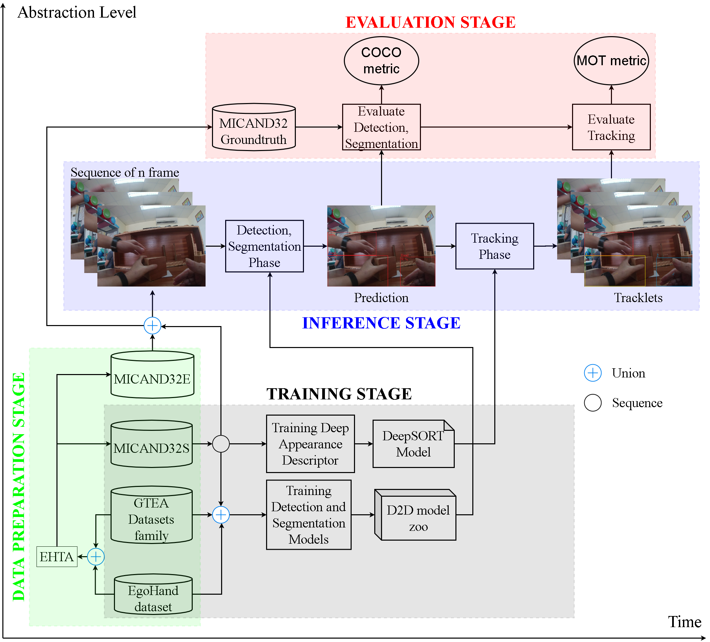

# Detection and tracking hand from FPV: benchmarks and challenges on rehabilitation exercises dataset
> [**Detection and tracking hand from FPV: benchmarks and challenges on rehabilitation exercises dataset**](https://drive.google.com/file/d/1rO0RTKC0oQ6smXz8R9Ea0O4PaffoGh6N/view?usp=sharing),            
> Van-Tien Pham, Thanh-Hai Tran, Hai Vu;        


   

> More details can be found [here](https://drive.google.com/file/d/1Vtrm9ewhfSIzIgXPKQhZ0iJUg47X85cr/view?usp=sharing) and [here](https://youtube.com/playlist?list=PLWBYzJD_wkfs1yHwuUp2Gq9HGCfF5lWiF).\
> Contact: [pvtien96@gmail.com](mailto:pvtien96@gmail.com). Discussions are welcome!

## Abstract
Egocentric vision is an emerging field of computer vision characterized by the acquisition video from the first person perspective. Particularly, for evaluating upper extremity rehabilitation, egocentric vision offers the ability to quantitatively measure the function of hands used in physical-based exercises. For such applications, hand detection and tracking are the first requirement. In this work, we develop a fully automatic tracking by detection pipeline that firstly extracts hands positions and then tracks hands in consecutive frames. The proposed framework consists of state of the art detectors such as RCNN and YOLO family models coupled with state-of-the-art trackers (e.g., SORT and DeepSORT) for tracking task. This paper explores how performance of the stand alone object detection algorithms correlates with overall performance of a tracking by detection system. The experimental results show that detection highly impacts the overall performance. Moreover, this work also proves that the use of visual descriptors in the tracking stage can reduce the number of identity switches and thereby increase potential of the whole system. We also present challenges for new egocentric hand tracking dataset for future works.

## News
- **[2021.02.28]** Paper is submitted to [RIVF 2021](http://rivf.net/#/).
- **[2020.10.31]** Related master thesis is successfully defended at [SOICT, HUST](https://soict.hust.edu.vn/).
- **[2020.06.04]** Demo code and pre-trained model released.


## Main results

Object detection and segmentation AP and AR following the COCO standard.
|  Algorithm |  AP  | AP50 | AP75 | APsmall | APmedium | APlarge | ARmax=1 | ARmax=10 | ARmax=100 | ARsmall | ARmedium | ARlarge |
|:----------:|:----:|:----:|:----:|:--------------:|:---------------:|:--------------:|:--------------:|:---------------:|:----------------:|:--------------:|:---------------:|:--------------:|
|   Yolov3   | 89.2 | 92.4 | 92.1 |       1.1      |       66.4      |      54.1      |       6.5      |       53.6      |       76.4       |       3.2      |       32.5      |      75.9      |
|   Yolov4x  | 93.1 | 95.6 | 94.6 |       3.2      |       72.5      |      42.9      |       8.7      |       65.8      |       89.7       |       7.1      |       40.1      |      82.7      |
| FasterRCNN | 96.2 | 97.9 | 97.9 |       0.9      |       75.8      |       6.3      |       9.6      |       76.8      |       97.6       |      10.0      |       77.8      |      97.6      |
|  MaskRCNN  | 92.1 | 98.9 | 97.9 |       0.0      |       32.4      |      92.2      |       9.2      |       73.9      |       94.6       |       0.0      |       50.8      |      94.7      |

Tracking result on Micand32 following MOT16 evaluation protocol.
| Method | IDF1 | IDP  | IDR  | Rcll | Prcn | GT | MT | PT | ML | FP  | FN   | IDs | FM  | MOTA | MOTP  |
|--------|------|------|------|------|------|----|----|----|----|-----|------|-----|-----|------|-------|
| Y3S    | 51.4 | 59.4 | 45.2 | 75.3 | 99.4 | 24 | 7  | 8  | 9  | 68  | 3630 | 123 | 174 | 74.1 | 0.133 |
| Y4S    | 56.7 | 60.7 | 53.0 | 86.4 | 99.4 | 24 | 9  | 11 | 4  | 81  | 1996 | 134 | 159 | 85.0 | 0.127 |
| FS     | 74.5 | 73.9 | 74.8 | 97.9 | 97.1 | 24 | 17 | 7  | 0  | 426 | 306  | 115 | 91  | 94.2 | 0.082 |
| MS     | 74.5 | 73.9 | 74.8 | 97.9 | 97.2 | 24 | 17 | 7  | 0  | 420 | 304  | 114 | 90  | 94.3 | 0.082 |
| GS     | 89.1 | 89.3 | 88.7 | 98.5 | 99.6 | 24 | 21 | 3  | 0  | 62  | 220  | 91  | 50  | 97.5 | 0.059 |
| Y3DS   | 58.7 | 66.0 | 52.6 | 78.4 | 98.7 | 24 | 9  | 7  | 8  | 149 | 3176 | 123 | 202 | 76.6 | 0.151 |
| Y4DS   | 65.0 | 68.1 | 61.9 | 89.3 | 98.5 | 24 | 11 | 9  | 4  | 194 | 1581 | 122 | 192 | 87.1 | 0.142 |
| FDS    | 79.4 | 79.0 | 79.5 | 98.1 | 97.8 | 24 | 17 | 7  | 0  | 320 | 282  | 117 | 75  | 95.1 | 0.060 |
| MDS    | 83.5 | 83.5 | 83.3 | 98.1 | 98.7 | 24 | 18 | 5  | 1  | 184 | 275  | 95  | 61  | 96.2 | 0.054 |
| GDS    | 88.5 | 88.5 | 88.1 | 99.1 | 99.9 | 24 | 23 | 1  | 0  | 12  | 135  | 82  | 43  | 98.4 | 0.052 |

## Installation

Please refer to [INSTALL.md](readme/INSTALL.md) for installation instructions.

## License

Code is released under the [Apache 2.0 license](LICENSE).

## Citing

If you use this work in your research or wish to refer to the results, please use the following BibTeX entry.

```BibTeX
@misc{tien2021d2dp,
  author =       {Van-Tien Pham and Thanh-Hai Tran and Hai Vu},
  title =        {Detection and tracking hand from FPV: benchmarks and challenges on rehabilitation exercises dataset},
  howpublished = {\url{https://github.com/pvtien96/Detectron2DeepSortPlus}},
  year =         {2021}
}
```
